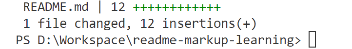

# Learning .md Markup Language

## Quoting Code

Use following structure to quote code, and specify the language after the first "```":

Bash:

```bash
#/bin/bash
cd my-app
```

Python:

```python
import numpy as np

i = 2
```

Also,

```HTML
 <code> this.a </code> 
 ```

can be used for inline code blocks, but not recommended due to format inconsistency. Instead, we may use a markup-style one, by:

```html
`your code`
 ```

## Quoting Text

> text:

```markup
> text
```

## Basic Styling

Basic styling is combinable.

**Bold**:

```markup
**text**
```

*Italic*:

```markup
*text*
```

~~Strikethrough~~ (delete line):

```markup
~~text~~
```

## List

### Bullet Points

Use "-"

- George Washington
- John Adams
- Thomas Jefferson

Using additional spaces before "-" will create further indentations.

- Tier 1
  - Tier 2
    -Tier 3

## Adding Pictures



By adding "-" before figures will also indent them.

## Links

Basically, the links look like \[Linked text in this file\]{the actual URL to the link destination}.

- Links to sections: \[Links\](directory#section). E.g. [Links](./README.md#links)

## Footnotes

Footnotes are basically similar to general links except that there is a "^" in the bracket.

For example, here's a simple footnote,[^1] and here's a longer one.[^bignote].

[^1]: Footnotes.

[^bignote]: Longer footnotes.

  Indent paragraphs to include them in the footnote.

  ```python
  import numpy as np
  ```
